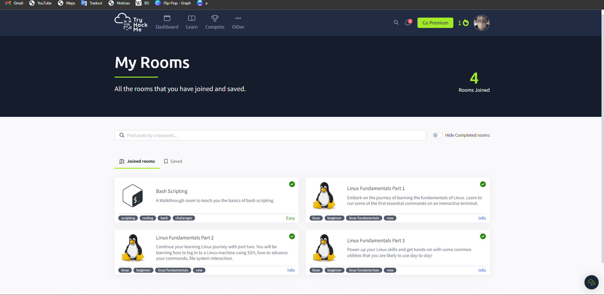

# Portafolio_de_tareas_SO
Portafolio de tareas de la materia Sistemas Operativos UPQROO

#####  Tarea #998 💻
- [x] Instalar Virtualbox y alguna distribucion de Linux, entregar para el 12/09/23, tomar screenshot del sistema ya instalado y subir la captura a su repositorio de tareas como evidencia.
      
_____

#####  Tarea #997 💻
- [x] Hacer el https://vim-adventures.com/ los niveles gratuitos, sacar un screenshot del ultimo nivel y subirlo a su repositorio de tareas para el 12/09/23 antes de clase. 
      
_____
#####  Tarea #996 💻  
Hacer un menú en bash que permita elegir la ejecución entre el script para crear un árbol de directorios, el script de hola mundo y el script de saludo usando variables y por último la opción de salir.

 
_______
#####  Tarea #995 💻

- [x] Crear un gif que explique algún concepto, relacionado al curso, que hayas aprendido.

_____
#####  Tarea #994 💻
- [x]  Realizar los 18 bash scripts que vienen en el PDF shell_linux.pdf, subirlos a su repositorio. Para hacer hoy durante la clase. 

<a href="https://github.com/davidakeprott/Portafolio_de_tareas_SO/blob/main/BASHMENU18" target="_blank">CARPETA 18 SCRIPTS</a> 
_____
#####  Tarea #993 💻
- [x] Realizar todos los niveles de Bandit de https://overthewire.org/wargames/bandit/ poner evidencia de los comandos utilizados en un txt
    <a href="https://github.com/davidakeprott/Portafolio_de_tareas_SO/blob/main/Comandos lvl Juego Bandit SO.txt" target="_blank">TEXT comandos Bandit </a> 
_____
#####  Tarea #986 💻
- [x] Servidores
  - SSH->Open SSh
  - Web->Apache
  - DB->MariaDB
  - ProxyWeb->Squid
  - Dns->Bind9

_____
#####  Tarea 992  💻
- [x] Participar en el hacktoberfest 2023
      
_____
#####  Tarea 989  💻
- [x] Tarea #991 Realizar los rooms de Linux Fundamentals de tryhackme https://tryhackme.com/room/linuxfundamentalspart1  los 3 rooms, solo los que sean gratis.

_____
#####  Tarea 989  💻
- [x] Realizar el room de Bash Scripting de TYryHackMe https://tryhackme.com/room/bashscripting

